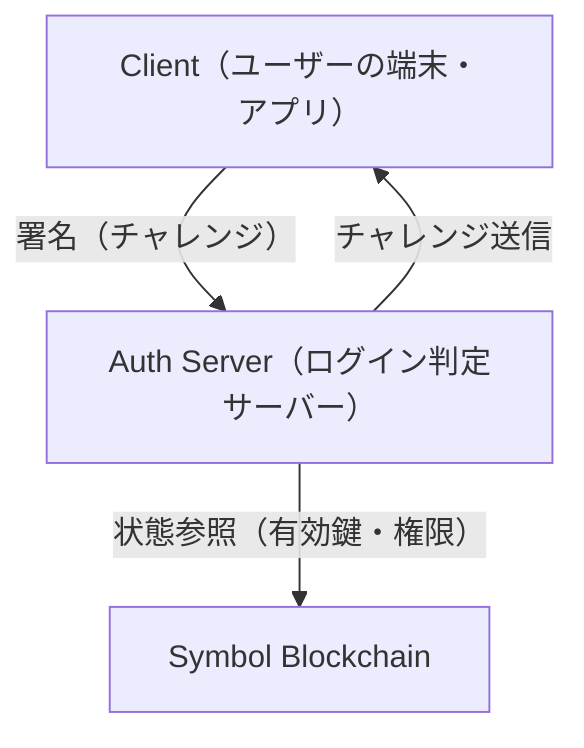
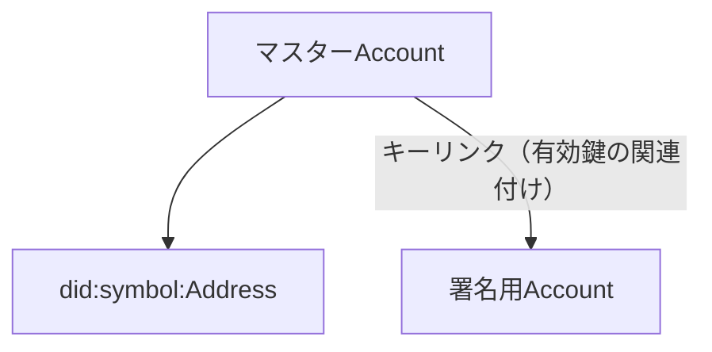
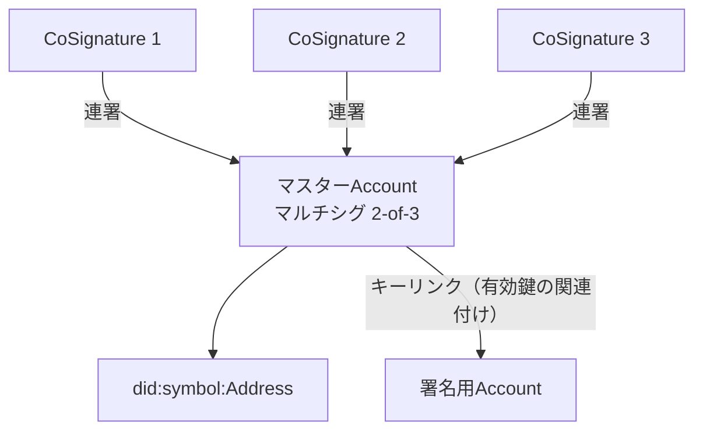

# Symbol Sign-On — DID 志向の署名認証基盤 —

- **Status:** Draft
- **Version:** 0.2
- **Last Updated:** 2026-01-16

---

## 1. 概要

Symbol Sign-On は、Symbol ブロックチェーンの署名機能（秘密鍵で「本人だと証明する」仕組み）を用いたパスワード不要の認証方式です。

本設計は、スマートコントラクト（ブロックチェーン上で自動実行されるプログラム）を使用せず、初心者から上級者まで段階的にセキュリティ強度を高められることを目的としています。

### 想定読者

- プロダクト責任者・事業責任者
- ステークホルダー（運用、法務、セキュリティ、企画など）

注: 実装者向けの詳細仕様（チャレンジ形式、トークン形式、署名対象の正規化等）は別文書で扱います。

## 2. 背景と課題

従来の認証方式には以下の課題があります。

- パスワード管理の限界と漏洩リスク
- 秘密鍵流出時の即時アカウント喪失
- DID 仕様は存在するが、実運用が難しい
- マルチシグは安全だが UX が難解

Symbol はこれらの課題に対し、L1（レイヤー1：ブロックチェーン基盤レイヤー）レベルで署名・権限管理を提供していますが、認証用途として体系化された事例は少ない状況です。

## 3. 目的

本設計の目的は以下のとおりです。

- パスワードを使用しない認証を実現する
- スマートコントラクトに依存しない
- 初心者でも安全に利用できる
- 中上級者はより強固な保護を選択できる
- DID 的な鍵更新・分離を可能にする
- シングルサインオン（SSO）により複数サービスでの利用を実現する

## 4. 非目的

本設計は以下を目的としていません。

- 投機・資産運用を主目的とする設計
- フル機能の DID 標準実装
- TLS や通信暗号の代替
- 自動実行ロジック（スマートコントラクト）

## 設計上の割り切り（Design Trade-offs）

Symbol Sign-On は DID Core（Decentralized Identifiers Core：分散型 ID の国際標準仕様）の全要素を忠実に再現することを目的とした設計ではありません。一般ユーザー向けの認証基盤として成立させるため、以下の点を意図的に簡略化・省略しています。

- DID Document（分散型 ID を記述する文書）の明示的な定義
- DID Resolver / Universal Resolver（DID を解決して情報を取得する仕組み）の実装
- 認証以外（VC、Service Discovery 等）の用途別鍵管理

> **注記:**  
> VC（Verifiable Credentials：検証可能な証明書）や Service Discovery（サービス情報の発見）などは、本コンセプトでは対象外とします。また、TLS（Transport Layer Security：通信の暗号化と相手確認の仕組み）の代替ではありません。

これらは分散アイデンティティの表現力を高めますが、ログイン用途においては UX（ユーザー体験）、実装コスト、運用負荷を著しく増加させる要因となります。本設計は「フル DID」ではないことを明示しつつも、以下の中核的な考え方は重視しています。

- 自己主権的な識別子（中央発行者を持たない）
- 識別子と鍵の分離
- 鍵ローテーションと失効可能性
- 第三者が検証可能な公開状態

これらは Symbol ブロックチェーンが L1 として提供する機能のみで実現可能であり、本書は DID の思想をログイン UX が成立する最小単位へ抽出した「DID 志向の署名認証基盤」と位置づけます。

### DID Core との関係

| 要素             | DID Core      | Symbol Sign-On             |
| ---------------- | ------------- | -------------------------- |
| 識別子           | DID URI       | did:symbol:Address         |
| Document         | 必須          | 定義しない                 |
| Resolver         | 必須          | 不要                       |
| 鍵ローテーション | Document 更新 | メタデータによるキーリンク |
| 主用途           | 汎用          | 認証特化                   |

## 5. 基本コンセプト

- クライアントは署名のみを行う
- サーバーは検証のみを行う
- ブロックチェーンは検証可能な事実の源泉とする
- 認証用アカウントは資産を保持しない

> **重要（検証モデル）**
>
> ログインの署名データ自体をオンチェーンに発行して検証することは前提にしません。
> **署名の正しさは常に Auth Server がオフチェーンで検証**し、ブロックチェーンは「有効鍵・権限関係・更新履歴」を解決するための公開レジストリとして参照します。

## 6. アカウントモデル

### 6.1 初期状態

マスターアカウントのアドレスを DID（分散型のユーザー識別子）とし、メタデータ（追加情報）によるアカウントキーリンク（「この署名鍵が有効」という紐付け）により署名アカウントとリンクさせます。

> **技術的背景:**  
> Symbol のアカウントキーリンクを使用するとリモートアカウントとなり、トランザクション（取引記録）をチェーンへ発行することができなくなるため、メタデータによる紐付けを採用しています。

- マスターアカウントは常時使用しない
- 署名用アカウントで署名を行う
- 署名用アカウントの秘密鍵が漏れた場合は、マスターアカウントで付け替えが可能
- キーの付け替えログもマスターアカウントのトランザクション（取引履歴）から集めることができる

> **特徴:**  
> マスターアカウントは常時使用せず、秘密鍵を厳重に保管。署名用アカウントを常用するようにし、もし秘密鍵が流出しても、マスターアカウントによりアカウントの付け替えが可能になり、非常に高いセキュリティを実現できます。

### 6.2 マスターアカウントをマルチシグで保護

> **注記:**  
> マルチシグ（複数の承認が揃わないと重要操作ができない仕組み）は UX 負担が大きく、設定や運用が難解になりがちです。したがって本設計ではマルチシグを多用せず、基本的にはシンプルな運用（単一のマスター + 署名用アカウント）を想定します。マルチシグ化はセキュリティ意識の高いユーザーや重要度の高いアカウントに対して任意で適用するオプションとします。

- 日常操作は署名用鍵で実施（流出してもマスターアカウントは安全）
- 署名用アカウントキーが流出しても、マスターアカウントを使用して付け替えることが可能

### 6.3 検証モデルの一貫性（設計方針）

本設計では、アカウント状態（シングルシグ／マルチシグ／キーリンク等）によって「検証をオンチェーンに寄せたりオフチェーンに寄せたり」しません。
**ログイン署名の検証は常にオフチェーン（Auth Server）で行い、ブロックチェーンは “有効鍵・権限関係・更新履歴” の参照元として用います。**

これにより、実装・運用は単一の検証パイプラインで済み、アカウント形態の違いは「Auth Server が参照するオンチェーン状態（ポリシー）の違い」に閉じます。

## 7. 段階モデル（UX 視点）

本設計では段階モデルを**2段階**に簡素化しました。マルチシグを多用すると理解や運用が難しくなるため、基本的には全ユーザーが「初期」フェーズで運用し、必要に応じて一部のユーザーのみが「強化」フェーズへ移行する形を想定します。

| フェーズ | 選択肢                                | 操作感               | セキュリティ |
| -------- | ------------------------------------- | -------------------- | ------------ |
| 初期     | キーリンク                            | 即時でシンプル       | 標準（十分） |
| 強化     | キーリンク + マスターの任意マルチシグ | 設定・理解の負荷あり | 高           |

> **注記:**  
> 「強化」フェーズのマルチシグは全員に必須ではなく、マスターアカウントの保護をより強固にしたいセキュリティ志向の高いユーザー向けのオプションです。

## 8. 認証フロー（概要）

1. サーバーが一時的なチャレンジを生成してクライアントへ送信
2. クライアントが署名してサーバーへ返送
3. サーバーが署名を検証し、必要に応じてオンチェーン（ブロックチェーン上）の鍵状態を参照して有効性を確認
4. 認証成功後、短期間有効なセッショントークン（例: JWT やサーバーセッション）を発行してセッション（ログイン状態）を管理

> **注記:**  
> 本書ではチャレンジやトークンの細かいフォーマット（形式）は示しません。実装詳細は別途仕様書や SDK（開発キット）ドキュメントで扱うこととし、ここでは運用上の要点と設計思想に集中します。

## 9. UX 設計方針

- 初期状態では専門用語を表示しない
- セキュリティ強化は任意とする
- 操作が変わる場合は事前に説明する
- 承認待ち状態を失敗と誤認させない

## 10. セキュリティ上の考慮

- リプレイ攻撃対策（nonce：使い回し防止のための一意な値）
- 鍵流出時の影響範囲限定
- 鍵更新・失効の明示
- クライアント・サーバー分離

> **注記:**  
> ここでの「セキュリティ上の考慮」は、非技術者がリスクの種類を把握できることを主目的とします。具体的な実装対策（ヘッダ、暗号スイート、保存方式など）は別文書で扱います。

### 10.1 脅威モデル

Symbol Sign-On が想定する主要な脅威と対策を以下に示します。

| 脅威                 | 影響度 | 対策                                     |
| -------------------- | ------ | ---------------------------------------- |
| リプレイ攻撃         | 高     | nonce、タイムスタンプによる一回性保証    |
| 秘密鍵の流出         | 高     | キーリンクによる鍵分離、影響範囲限定     |
| フィッシング         | 中     | 署名対象の可視化、ドメイン検証           |
| 中間者攻撃（MitM）   | 中     | TLS 必須、署名データへのサーバー識別情報 |
| サーバー側 DB 改ざん | 中     | ブロックチェーンとの照合による検証       |
| クライアント端末侵害 | 高     | キーリンク、操作ログの記録               |
| DDoS・過負荷攻撃     | 低     | レート制限、JWT 活用による API 分離      |
| アカウント乗っ取り   | 高     | キーリンク、必要に応じてマルチシグ       |

> **設計原則**
>
> - 単一障害点を作らない（キーリンクによる鍵分離）
> - オフチェーン情報に過度に依存しない（JWT 活用で負荷軽減）
> - ユーザーに脅威を理解させる UI 設計
> - 段階的なセキュリティ強化を可能にする

## 11. 今後の展開

- RFC（Request for Comments：技術仕様の標準化文書）風の詳細仕様書を別途作成
- 実装向けの SDK（Software Development Kit：開発キット）と UI サンプルを段階的に提供

## 12. まとめ

Symbol Sign-On は、署名を中心に据えたシンプルで実用的な認証基盤を目指します。本稿は概念と運用方針を示すコンセプトシートであり、実装仕様やプロトコル詳細は別文書で整理します。

## 用語メモ（非技術者向け）

- ブロックチェーン: みんなで共有して改ざんしにくい記録台帳（ここでは「公開の参照元」）
- 署名: 秘密鍵を持っている本人だけが作れる証明データ
- 秘密鍵: 本人確認に使う「絶対に漏らしてはいけない鍵」
- DID: 中央発行者に依存しない識別子（ここでは Symbol のアドレスを識別子として扱う）
- オンチェーン／オフチェーン: ブロックチェーン上／ブロックチェーン外（通常サーバー上）
- Auth Server: ログイン判定と検証を行うサーバー
- チャレンジ: 使い回しできない「その場限りの合言葉」。署名対象にしてリプレイ（使い回し）を防ぐ
- nonce: チャレンジに含める「一意な値」。同じ署名の使い回し（リプレイ）を防ぐ
- キーリンク: 「いま有効な署名鍵はこれ」という紐付け（鍵の差し替えを可能にする）
- マルチシグ: 複数人（複数鍵）の承認が揃わないと重要操作ができない仕組み
- SSO: 一度ログインすると複数サービスで再ログインを減らせる仕組み
- JWT: JSON Web Token の略。ログイン後に「認証済み」であることを示す短期トークンの一例（形式の詳細は別文書）
- TLS: Transport Layer Security の略。通信を暗号化して盗聴や改ざんを防ぐ仕組み
- DDoS: Distributed Denial of Service の略。大量アクセスでサービスを落とす攻撃
- MitM（中間者攻撃）: Man-in-the-Middle の略。通信の途中に割り込んで盗聴・改ざんする攻撃
- レート制限: 短時間に大量のリクエストを制限し、システムを保護する仕組み
- SDK: Software Development Kit の略。ソフトウェア開発を支援するツールやライブラリのセット
- API: Application Programming Interface の略。アプリケーション間でデータをやり取りする仕組み

---

> **メモ**
>
> 本文書は Draft であり、今後変更される可能性があります。
