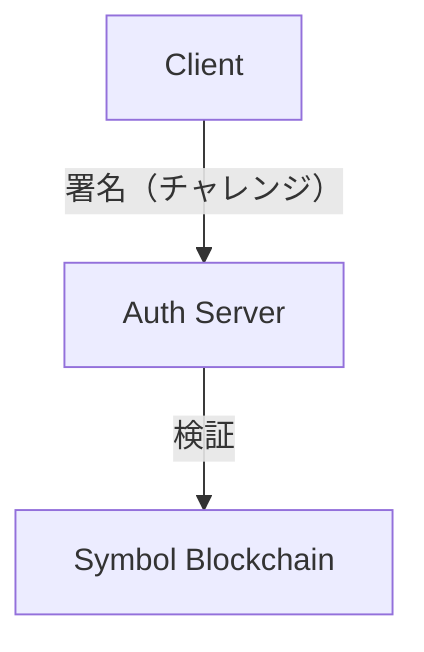
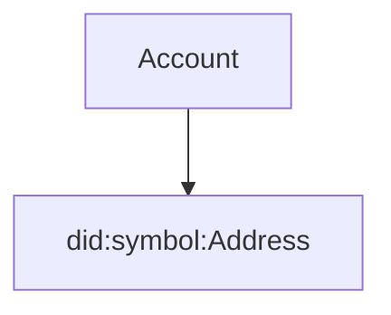
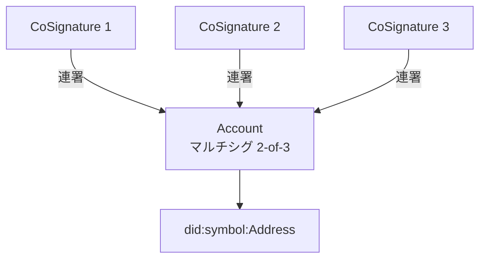
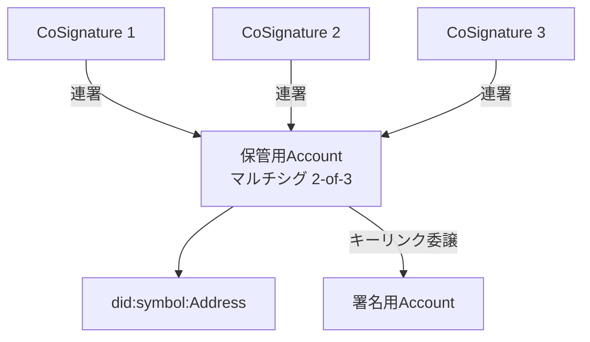
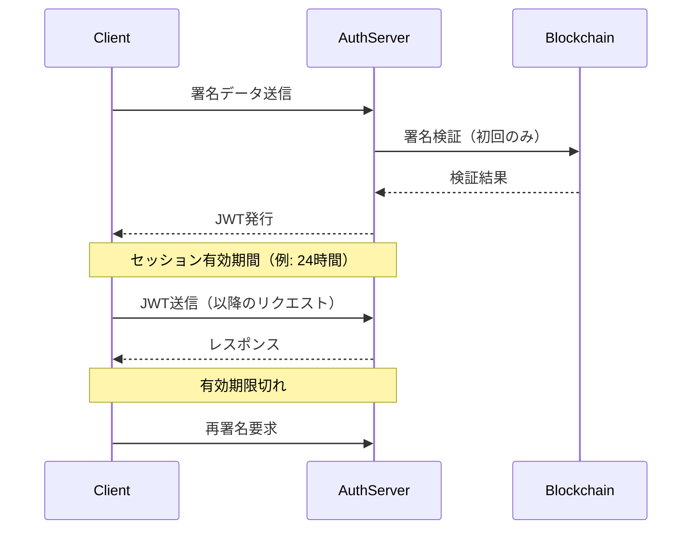

# Symbol Sign-On — DID 志向の署名認証基盤 —

- **Status:** Draft
- **Version:** 0.1
- **Last Updated:** 2026-01-13

---

## 1. 概要

Symbol Sign-On は、Symbol ブロックチェーンの署名機能を用いたパスワード不要の認証方式です。

本設計は、スマートコントラクトを使用せず、初心者から上級者まで段階的にセキュリティ強度を高められることを目的としています。

## 2. 背景と課題

従来の認証方式には以下の課題があります。

- パスワード管理の限界と漏洩リスク
- 秘密鍵流出時の即時アカウント喪失
- DID 仕様は存在するが、実運用が難しい
- マルチシグは安全だが UX が難解

Symbol はこれらの課題に対し、L1 レベルで署名・権限管理を提供しているが、認証用途として体系化された事例は少ない。

## 3. 目的

本設計の目的は以下のとおりです。

- パスワードを使用しない認証を実現する
- スマートコントラクトに依存しない
- 初心者でも安全に利用できる
- 中上級者はより強固な保護を選択できる
- DID 的な鍵更新・分離を可能にする
- シングルサインオン（SSO）により複数サービスでの利用を実現する

## 4. 非目的

本設計は以下を目的としていません。

- 投機・資産運用を主目的とする設計
- フル機能の DID 標準実装
- TLS や通信暗号の代替
- 自動実行ロジック（スマートコントラクト）

## 5. 基本コンセプト



- クライアントは署名のみを行う
- サーバーは検証のみを行う
- ブロックチェーンは検証可能な事実の源泉とする
- 認証用アカウントは資産を保持しない

## 6. アカウントモデル

### 6.1 初期状態



| 項目       | 内容                           |
| ---------- | ------------------------------ |
| アカウント | 1 つ                           |
| 鍵         | 1 つ                           |
| 方式       | シングルシグ                   |
| DID 識別子 | アカウントアドレス             |
| 署名       | ログイン署名と操作署名は同一鍵 |

- ユーザーには「これがあなたのアカウント」とだけ説明される

### 6.2 セキュリティ強化（任意）

ユーザーの明示操作により、以下のいずれかを選択できます。

#### A. マルチシグによる保護



- アカウントをマルチシグ化
- 複数承認による操作
- 操作は「送信」から「承認」に変化
- 最高レベルのセキュリティを実現

> **特徴:**  
> 秘密鍵が 1 つ流出しても、他の鍵がなければアカウントを操作できないため、非常に高いセキュリティを実現できます。
> ただし、すべての操作で複数の署名が必要になるため、承認待ちが発生します。

#### B. アカウントキーリンクによる保護



- 保管用アカウント：元々のアカウント（DID の主体）
- 署名用アカウント：新たに作成し、リンクされた署名用アカウント
- 日常操作は操作用鍵で実施（流出しても保管用アカウントは安全）
- 署名用アカウントキーが流出しても、保管用アカウントを使用して付け替えることが可能
- 操作感はシングルシグのまま
- セキュリティと利便性のバランスを実現

> **注意:**  
> アカウントキーリンクを有効化すると、管理する鍵が 2 つになります。  
> この課題を軽減するため、以下のような工夫が考えられます：
>
> - 操作用アカウントの自動生成とリンク設定の自動化
> - 操作用アカウントの鍵をハードウェアウォレットやセキュリティトークンで管理
> - 保管用アカウントに対して、必要に応じてマルチシグ設定を追加

## 7. 段階モデル（UX 視点）

| フェーズ | 選択肢                | 操作感   | セキュリティ |
| -------- | --------------------- | -------- | ------------ |
| 初期     | シングルシグ          | 即時完了 | 低           |
| 強化 A   | マルチシグ            | 承認待ち | 高           |
| 強化 B   | キーリンク            | 即時完了 | 中           |
| 強化 B+  | キーリンク+マルチシグ | 即時完了 | 高           |

> ※ 強化 B では、さらに保管用アカウントに対してマルチシグを設定することで、操作性とセキュリティを両立できます（強化 B+）。

## 8. 認証フロー（概要）

1. サーバーがチャレンジを生成
2. クライアントが署名
3. サーバーが署名を検証
4. 必要に応じて DID 情報を参照
5. 認証完了、JWT/セッショントークンを発行

### 8.1 セッション管理

Symbol Sign-On では、JWT（JSON Web Token）またはセッショントークンを用いてセッション管理を実現します。

#### セッションフロー



#### JWT 構造（例）

```json
{
  "sub": "did:symbol:Address",
  "iat": 1673600000,
  "exp": 1673686400,
  "scope": "read:profile write:transactions",
  "nonce": "ランダムな一意識別子"
}
```

- `sub`: DID（ユーザー識別子）
- `iat`: トークン発行時刻
- `exp`: トークン有効期限（推奨: 24 時間）
- `scope`: アクセス権限
- `nonce`: リプレイ攻撃防止用の一意識別子

#### 利点

- **オンチェーンアクセスの最小化**  
  トークン発行後はオンチェーンへの問い合わせが不要となり、手数料や負荷を削減できます。

- **スケーラビリティ**  
  JWT はステートレスで検証可能なため、サーバー負荷が軽減されます。

- **柔軟なセッション制御**  
  トークンにカスタムクレーム（権限、DID 情報など）を含めることで、柔軟な認証フローを実現できます。

- **シングルサインオン（SSO）対応**  
  一度の署名認証で発行された JWT を複数のサービスで共有することで、シングルサインオンを実現できます。ユーザーは 1 回の署名で複数の関連サービスにアクセス可能になります。

#### セキュリティ考慮事項

- HTTPS 通信を必須とする
- トークンの有効期限を適切に設定（推奨: 24 時間以内）
- リフレッシュトークンによる自動延長機能の提供
- トークン盗難時の無効化機能

### 8.2 チャレンジ仕様（草案）

認証に用いるチャレンジは以下の形式を推奨します。

```json
{
  "challenge": "ランダムなバイト列（32バイト以上推奨）",
  "timestamp": "ISO 8601形式のタイムスタンプ",
  "service": "認証サービスの識別子（例: example.com）",
  "nonce": "一意な識別子（UUID等）",
  "expiresAt": "チャレンジの有効期限"
}
```

**要件**

- `challenge`：暗号学的に安全な乱数生成器を使用
- `timestamp`：サーバー時刻を基準とし、クライアント時刻との差異を許容
- `service`：フィッシング対策として、ユーザーが署名対象を確認可能にする
- `nonce`：リプレイ攻撃防止用。サーバー側で一定期間保持し重複利用を拒否
- `expiresAt`：チャレンジの有効期限（推奨: 5 分以内）

**署名対象データ**

上記 JSON を正規化（例: JCS）した上で、SHA-256 ハッシュを取り、Symbol の署名形式に従って署名します。

## 9. UX 設計方針

- 初期状態では専門用語を表示しない
- セキュリティ強化は任意とする
- 操作が変わる場合は事前に説明する
- 承認待ち状態を失敗と誤認させない

## 10. セキュリティ上の考慮

- リプレイ攻撃対策（nonce）
- 鍵流出時の影響範囲限定
- 鍵更新・失効の明示
- クライアント・サーバー分離

### 10.1 脅威モデル

Symbol Sign-On が想定する主要な脅威と対策を以下に示します。

| 脅威                 | 影響度 | 対策                                     |
| -------------------- | ------ | ---------------------------------------- |
| リプレイ攻撃         | 高     | nonce、タイムスタンプによる一回性保証    |
| 秘密鍵の流出         | 高     | キーリンクによる鍵分離、影響範囲限定     |
| フィッシング         | 中     | 署名対象の可視化、ドメイン検証           |
| 中間者攻撃（MitM）   | 中     | TLS 必須、署名データへのサーバー識別情報 |
| サーバー側 DB 改ざん | 中     | ブロックチェーンとの照合による検証       |
| クライアント端末侵害 | 高     | キーリンク、操作ログの記録               |
| DDoS・過負荷攻撃     | 低     | レート制限、JWT 活用による API 分離      |
| アカウント乗っ取り   | 高     | キーリンク、必要に応じてマルチシグ       |

> **設計原則**
>
> - 単一障害点を作らない（キーリンクによる鍵分離）
> - オフチェーン情報に過度に依存しない（JWT 活用で負荷軽減）
> - ユーザーに脅威を理解させる UI 設計
> - 段階的なセキュリティ強化を可能にする

## 11. 今後の展開

- RFC 風仕様書の作成
- SDK・UI サンプルの提供

## 12. まとめ

Symbol Sign-On は、暗号資産ではなく、署名と信頼を扱う基盤として Symbol を活用する試みです。

---

> **メモ**
>
> 本文書は Draft であり、今後変更される可能性があります。
